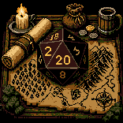

<p align="center">
  
</p>

<h1 align="center">Natural 20</h1>

<p align="center">
  <em>Diablo loot. Skyrim dialogue. The d20 has the final word.</em>
</p>

<p align="center">
  <a href="https://nat20mod.com">Website</a> ·
  <a href="https://nat20mod.com/wiki/">Wiki</a> ·
  <a href="https://www.curseforge.com/hytale/mods/natural20">CurseForge</a> ·
  <a href="https://discord.gg/FXwCmw8muw">Discord</a>
</p>

---

## What is Natural 20?

Natural 20 is an RPG mod for Hytale that combines D&D-style quests and dialogue with ARPG-style loot and progression. Multi-phase quests with d20 skill checks are the core gameplay loop. Leveling, loot, and tiered encounters scale to support questing.

## Features

- **Multi-Phase Quests**: each phase pays its own XP and a freshly rolled item; six objective types including bosses and peaceful fetches.
  - **Skill Checks**: pick a `[Persuasion]` or `[Intimidation]` response, roll a d20 against a DC, see the dice land in-world.
  - **Disposition**: per-NPC, per-player attitude (0-100) that swings skill checks into advantage or disadvantage.
- **Ability Scores**: STR/DEX/CON/INT/WIS/CHA (0-30) drive every dice roll, gear affix, and combat formula.
- **Randomized Loot**: ARPG-style itemization across five rarity tiers, item-level scaling, 40+ affixes covering offense, defense, abilities, elemental damage, resistances, and stat boosts.
- **Champion & Boss Encounters**: themed mob packs across four difficulty tiers with stacking affixes and named bosses.
- **Settlements & Hostile POIs**: generated as new chunks load; existing systems work on already-explored worlds.

For the full breakdown, see [the wiki](https://nat20mod.com/wiki/) or the [CurseForge page](https://www.curseforge.com/hytale/mods/natural20).

## Install (server admins)

1. Download `Natural20-Bundle-<version>.zip` from [CurseForge](https://www.curseforge.com/hytale/mods/natural20).
2. Extract it at your server root: `mods/` and `earlyplugins/` populate automatically.
3. Add `--accept-early-plugins` to your server start command and restart.

Full instructions, hosted-panel notes, and the singleplayer install paths live in the [install guide](https://nat20mod.com/wiki/getting-started/installation/).

## Build from source (devs)

Requires Java 25 and a Hytale dev environment.

```bash
git clone https://github.com/ChonbosMods/Natural20.git
cd Natural20
./gradlew bundleZip
```

Output lands at `build/libs/Natural20-Bundle-<version>.zip`. The task also produces both intermediate jars (`build/libs/Natural20-<version>.jar` and `tools/nat20-patches/build/libs/Natural20-Patches-<version>.jar`) for dev iteration. Version is set once in the root `gradle.properties`. To run a live dev server, copy the patches jar into `devserver/earlyplugins/` (the only thing that lives there), then `./gradlew devServer`. It adds `--accept-early-plugins` for you.

## Community

- [Discord](https://discord.gg/FXwCmw8muw) for support, feedback, and patch notes.
- Issues and feature requests welcome on the [GitHub tracker](https://github.com/ChonbosMods/Natural20/issues).

## License

Proprietary. See [LICENSE](LICENSE).
